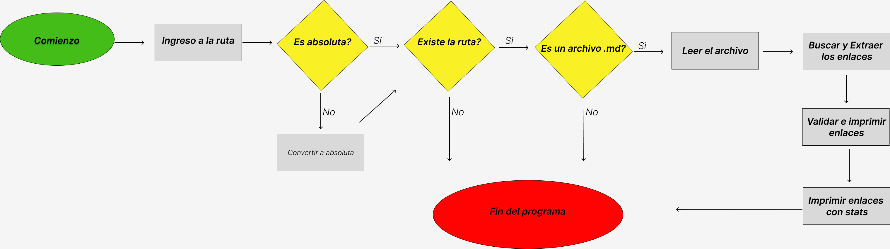

# Markdown Links

---

## Descripción

Md-Links es una librería en Node.js diseña para analizar enlaces dentro de archivos [Markdown].
Este proyecto ofrece dos formas de integración: como módulo instalable desde GitHub, permitiendo su incorporación en otros proyectos, y como una interfaz de línea de comandos (CLI) brindando la flexibilidad de ser utilizada desde la terminal.

### Características Destacas:

- Validación de Enlaces: `md-links` facilita la tarea de verificar la validez de los enlaces presentes en documentos `Markdown`.
- Interacción con el Sistema de Archivos: Aprovechando la capacidad de [Node.js], la librería proporciona funciones para buscar y leer archivos, ofreciendo una gestión eficiente de documentos.
- Interfaz de Línea de Comandos (CLI): La CLI de `md-links` permite realizar análisis de enlaces de manera rápida y directa desde la terminal.

### Instalación

Podrás instalar esta librería `md-links` utilizando NPM (Node Package Manager) de la siguiente manera:

1. Abrir la terminal bash y ejecutar el siguiente comando:

`npm i md-links-tiare-ism`

2. Uso:

`md-links [ruta del archivo] [options]`

- ruta del archivo: reemplazar con la ruta del archivo que se desea analizar.
- options: acepta dos parametros:

1. `--validate` realiza una verificación adicional de cada enlace para determinar su estado.
2. `--stats` mostrará estadísticas simples sobre los enlaces encontrados.
3. `--validate` `--stats` uso combinado, mostrará estadísticas sobre los enlaces y también los validará.

### Diagrama de Flujo

Este diagrama de Flujo ilustra el proceso y la lógica de `md-links`.

- 
